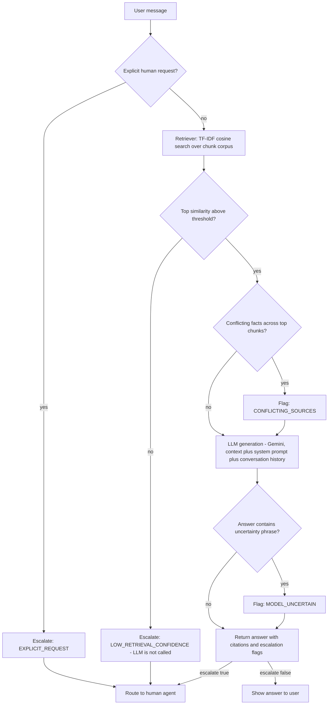

# System Design

## End-to-end query flow

## Components

- **Ingestion** (`src/ingest.py`, offline/batch): parses the three raw
  markdown sources into one JSON record per FAQ/policy/ticket entry,
  extracting `last_updated`, staleness flags, and ticket status. Run once
  (or on every knowledge-base update); output is `data/chunks.jsonl`.
- **Retriever** (`src/retriever.py`): TF-IDF vectorizer + cosine similarity
  over the chunk corpus, in-process, no external calls.
- **Assistant / orchestration** (`src/assistant.py`): the escalation state
  machine shown above. Owns conversation history (`SupportAssistant.history`,
  a list of `Turn`s) so multi-turn context is available for future
  query-rewriting (see trade-offs) even though the current version retrieves
  on the raw latest user message.
- **LLM client** (`src/llm.py`): thin wrapper around the Gemini free-tier
  chat API (`google-generativeai`), with a `MockLLM` fallback used when no
  `GOOGLE_API_KEY` is set, so the retrieval + escalation logic can be
  exercised and tested with zero cost and no network dependency.
- **CLI** (`src/cli.py`): interactive multi-turn REPL over `SupportAssistant`.
- **Eval harness** (`eval/`): a fixed question set with expected
  escalation outcomes and expected retrieved-chunk ids; `eval/run_eval.py`
  scores retrieval hit-rate and escalation-trigger accuracy automatically.
  See README §Eval plan for the parts of quality this does *not* cover and
  how those would be measured.

## Why this shape

The one property every requirement in the brief traces back to
(hallucination reduction, escalation, freshness) is: **retrieval is a gate,
not just a context provider.** The LLM is deliberately not the first or only
line of defense — a chunk that doesn't clear the similarity threshold means
the model is never invoked for that turn, which is cheaper and structurally
prevents "confidently answer anyway" hallucination on out-of-scope
questions (see eval cases E08/E09/E14).
